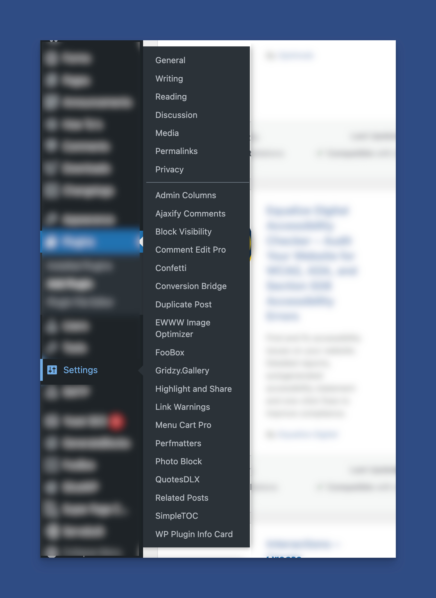

# Sortacular



Alphabetize non-core menu items in the following admin menus:

1. Dashboard (index.php)
2. Appearance
3. Tools
4. Settings

In Multisite, the following are sorted:

1. Dashboard
2. Themes
3. Settings


## Installation

[Download Sortacular v1.0.0](https://github.com/DLXPlugins/sortacular/releases/tag/1.0.0)

1. Download Sortacular from the above release. You'll find an attached ZIP that you can download.
2. Upload the `sortacular` folder to the `/wp-content/plugins/` directory.
3. Activate the plugin through the 'Plugins' menu in WordPress.
4. Navigate in the admin to the Settings or Tools section and observe any automatic sorts.

## Usage

Once activated, the plugin will automatically sort the sub-menu items for the "Settings" admin menu item alphabetically. Nothing else is needed.

## Filters

You can customize which submenu items are treated as "Core" (kept at the top in default order) by filtering the slug arrays. Useful when WordPress adds new Core pages before the plugin is updated, or to treat a custom item as Core.

Each filter receives an array of menu slugs (the `[2]` value from each submenu item). Add or remove slugs to change what stays in the Core group. Return the modified array.

| Filter | Menu | Default slugs (examples) |
|--------|------|--------------------------|
| `sortacular_core_settings_slugs` | Settings | `options-general.php`, `options-writing.php`, `options-reading.php`, etc. |
| `sortacular_core_multisite_settings_slugs` | Multisite → Settings | `settings.php`, etc. |
| `sortacular_core_appearance_slugs` | Appearance | `themes.php`, `site-editor.php`, `font-library.php`, `nav-menus.php`, `theme-editor.php`, etc. |
| `sortacular_core_tools_slugs` | Tools | `tools.php`, `import.php`, `export.php`, `site-health.php`, `theme-editor.php`, `plugin-editor.php`, etc. |
| `sortacular_core_dashboard_slugs` | Dashboard (single and Multisite)| `index.php`, `update-core.php` |

**Example: add a new Core Settings page**

When WordPress adds a new Settings screen (e.g. `options-newfeature.php`), you can treat it as Core until the plugin is updated:

```php
add_filter( 'sortacular_core_settings_slugs', function( $slugs ) {
    $slugs[] = 'options-newfeature.php';
    return $slugs;
} );
```

**Example: remove an item from Core**

To allow a Core item to be sorted with the rest (e.g. move "Privacy" into the alphabetical section):

```php
add_filter( 'sortacular_core_settings_slugs', function( $slugs ) {
    return array_diff( $slugs, array( 'options-privacy.php' ) );
} );
```


## Changelog

### 1.0.0
* Initial release

## License

Sortacular is licensed under the GPL v3 or later.
